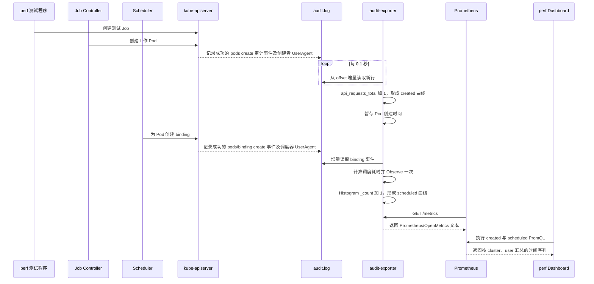

# kube-apiserver-audit-exporter 源码分析

如非必要用源码，尽量使用自然语言来解释。

## 1. audit-exporter 是什么

`kube-apiserver-audit-exporter` 是一个面向 Kubernetes API Server 审计日志的 **Prometheus 指标转换器**。它读取 API Server 写入磁盘的 JSON Lines 审计日志，识别成功的 Pod、Job 等 API 事件，并将其转换为计数器或延迟直方图。

它不是通用的日志采集/转发组件：

- 不调用 API Server 接口拉取日志；
- 不把原始日志发送到 Elasticsearch、Loki 或其他日志系统；
- 只在内存中维护由审计事件计算出的 Prometheus 指标，并通过 HTTP 暴露。

当前提供的业务指标如下：

| 指标 | 类型 | 含义 |
| --- | --- | --- |
| `api_requests_total` | Counter | 成功 API 请求数，按集群、命名空间、客户端、动作、资源和状态码区分 |
| `pod_scheduling_latency_seconds` | Histogram | Pod 从创建到创建 `pods/binding` 的调度耗时 |
| `pod_deleted_total` | Counter | 被删除且曾被本进程跟踪的 Pod 数 |
| `pod_completed_total` | Counter | 进入 `Succeeded` 或 `Failed` 阶段的 Pod 数 |
| `batchjob_completion_latency_seconds` | Histogram | Kubernetes/Volcano Job 从创建到完成的耗时 |
| `yunikorn_workload_pods_scheduled_total` | Counter | `cluster=yunikorn` 时，由 `kube-controller-manager` 创建并成功绑定的工作负载 Pod 数；排除 YuniKorn placeholder Pod |

指标定义及事件到指标的转换位于 `exporter/metrics.go`，审计事件的简化对象模型位于 `exporter/model.go`。

## 2. audit-exporter 怎样 export API Server logs

准确地说，exporter 导出的不是原始 logs，而是由 logs 计算出的 metrics。完整前提和读取方式如下。

### 2.1 API Server 先生成审计日志

仓库中的 `audit-policy.yaml` 要求对 Pod、Pod binding/status、Kubernetes Job 和 Volcano Job 的 `create`、`patch`、`update`、`delete` 操作记录 `RequestResponse` 级别事件，其余请求记录 `Metadata`。`RequestResponse` 很重要，因为 Pod/Job 状态及耗时计算需要审计事件中的 `responseObject`。

部署时还必须在 `kube-apiserver` 上配置审计策略和日志文件，例如：

```text
--audit-policy-file=/etc/kubernetes/audit-policy.yaml
--audit-log-path=/var/log/kubernetes/audit/audit.log
--audit-log-format=json
```

API Server 与 exporter 必须能访问同一个审计日志文件。在容器环境中通常通过 hostPath 或共享 Volume 将日志挂载给 exporter；本仓库没有提供这部分 Kubernetes 部署清单。

### 2.2 exporter 增量读取文件

启动参数由 `cmd/kube-apiserver-audit-exporter/main.go` 定义：

| 参数 | 默认值 | 作用 |
| --- | --- | --- |
| `--audit-log-path` | `./audit.log` | 审计文件；可重复指定，格式为 `path[:clusterName]` |
| `--cluster-label` | 空字符串 | 没有在 path 后指定时使用的默认 `cluster` 标签 |
| `--address` | `:8080` | 指标 HTTP 服务监听地址 |
| `--replay` | `false` | 按原事件的时间间隔逐步重放历史日志，而不是立即吃完文件 |
| `--start-at-end` | `false` | 启动时从当前文件末尾开始，只处理之后追加的事件 |
| `--delay` | `0` | 文件可用后延迟启动读取器 |

进程启动后，HTTP 指标服务会立即监听；后台任务则等待所有配置的审计文件都存在且非空，再为每个文件创建一个独立的 `Exporter`。

每个 `Exporter` 启动时打开一次主路径 `audit.log` 并持续持有该文件句柄，每 `0.1` 秒用内存中的 `offset` 读取新增字节：

1. 比较已持有文件句柄与当前主路径 `audit.log` 指向的文件身份。
2. 两者相同时，从当前 `offset` 继续读取新增内容。
3. 两者不同时，先读完旧句柄所指文件的剩余内容，再打开新的 `audit.log` 并从头读取。
4. 按换行读取 JSON；因此输入必须是一行一个完整审计事件。
5. 将每行反序列化为 Kubernetes `audit.k8s.io/v1.Event`。
6. 仅处理 `responseStatus.code` 为 `2xx` 的成功事件。
7. 根据资源、verb、subresource、阶段、时间戳和 `responseObject` 更新 Prometheus 指标。
8. 成功处理后推进 `offset`，下一轮从新位置继续读取。

`offset`、Pod/Job 创建时间和 YuniKorn Pod 状态都只保存在进程内；进程重启后会丢失。默认模式重启会从文件开头重新统计，可能造成 Counter 重计和 Histogram 重复观察。

### 2.3 exporter 刚启动时如何读取 `audit.log`

默认情况下，exporter 刚启动时会从 `audit.log` 的开头读取。启用 `--start-at-end` 后，初始 `offset` 设置为启动时的文件末尾，只处理随后追加的事件。

原因是每个新建的 exporter 都把读取位置 `offset` 初始化为 `0`。启动后，它先等待 `audit.log` 存在且不为空，然后从文件第 0 个字节开始读取。因此，如果启动时文件中已经有历史日志，这些历史日志也会被处理，而不是只读取启动后新增的日志。

> **注释：`offset=0` 在哪里设置？** 源码没有显式写 `offset: 0`。`Exporter` 结构体将 `offset` 声明为 `int64`，而 `NewExporter()` 创建对象时没有给它赋值，因此 Go 自动将其初始化为 `int64` 的零值 `0`。相关定义位于 `exporter/exporter.go` 的 `Exporter.offset` 和 `NewExporter()`。

首次读取完成后，`offset` 会停在已经处理完的位置。例如启动时文件有 100 MB，exporter 读取到第 100 MB 后，就把这个位置记在内存中。下一次检查时，不再重读前面的内容，而是从该位置继续读取新增日志。

`audit.log` 在 exporter 读取期间可以继续增长，exporter 能跟上这些更新：

> **“exporter 本轮”是什么意思？** exporter 启动后会循环检查 `audit.log`。“一轮”指一次完整的检查和读取过程：检查文件大小，从当前 `offset` 开始读取，持续处理完整日志行，直到读到当时的文件末尾后返回。随后 exporter 等待约 `0.1` 秒，再开始下一轮。这里的“一轮”不是一条审计日志，也不是一次 Prometheus 抓取。

```text
exporter 启动：offset = 0
        ↓
读取已有日志：offset 不断向后移动
        ↓
API Server 同时继续向 audit.log 追加新事件
        ↓
exporter 本轮能读到的就继续读取
        ↓
到达当时的文件末尾后结束本轮
        ↓
约 0.1 秒后再次检查文件，从上次 offset 继续读取
```

如果 API Server 正在写入最后一条日志，而这一行 JSON 还没有写完整，exporter 会在本轮到达文件末尾时停止，并且不会推进这条不完整记录对应的 `offset`。等 API Server 补全该行后，下一轮会从同一位置重新读取完整事件。因此，正常的文件追加不会导致新增日志被永久漏掉，只会产生最多约一个轮询周期的延迟。

需要注意以下行为：

- `offset` 只保存在内存中，exporter 重启后又会从 `0` 开始，重新统计当前文件里的历史事件。
- 如果不想让重启后的历史日志再次进入指标，可以启用 `--start-at-end`；该参数不持久化 offset，只以本次进程启动时的文件末尾作为起点。
- 默认 `--replay=false` 时，exporter 会尽快处理已有历史日志；`--replay=true` 时，则会参考审计事件的时间戳逐步重放，处理速度不再是一次性追到文件末尾。
- exporter 的读取速度必须长期高于 API Server 写入速度，才能最终追上最新位置；如果日志产生得更快，读取不会丢数据，但延迟和未处理积压会持续增加。

### 2.4 `audit.log` 的轮转机制以及 exporter 是否处理

#### API Server 怎样轮转审计日志

API Server 会一直向 `--audit-log-path` 指定的当前日志文件追加事件。可以通过以下参数控制轮转和旧日志保留：

| API Server 参数 | 作用 |
| --- | --- |
| `--audit-log-maxsize` | 当前日志文件达到多大后进行轮转，单位是 MiB |
| `--audit-log-maxbackup` | 最多保留多少个已经轮转的旧日志文件 |
| `--audit-log-maxage` | 旧日志最多保留多少天 |
| `--audit-log-compress` | 是否压缩已经轮转的旧日志 |

当写入下一条审计事件会使当前文件超过 `maxsize` 时，API Server 会：

1. 关闭当前的 `audit.log`。
2. 将它重命名为带时间戳的备份文件。
3. 创建一个新的空 `audit.log`，继续写入后续事件。
4. 根据 `maxbackup` 和 `maxage` 清理过多或过旧的备份文件。

因此，轮转不是清空同一个文件，而是把旧文件移走，再用原路径创建一个新文件：

```text
轮转前：audit.log（接近大小上限）

轮转后：audit-<时间戳>.log（旧事件）
        audit.log（新事件从头写入）
```

`kube-scheduling-perf` 的常驻集群当前配置为：

```text
--audit-log-maxsize=10240   # 单个当前日志约 10 GiB
--audit-log-maxbackup=3    # 最多保留 3 个轮转备份
--audit-log-maxage=7       # 备份最多保留 7 天
```

#### 当前 exporter 怎样处理轮转

Exporter 启动时打开一次主路径 `audit.log`，后续轮询持续使用该句柄。每轮先使用 `os.SameFile` 比较已打开文件与当前主路径对应文件的设备号和 inode：

- 文件身份相同：继续从现有 offset 读取追加内容。
- 文件身份不同：说明主路径已经轮转为新文件。旧句柄仍指向已被改名的旧日志，因此先读完旧文件尾部，再关闭旧句柄、打开新的 `audit.log`，并从新文件开头读取。

Exporter 不扫描历史备份文件。它能保证运行期间观察到的正常 kube-apiserver 轮转在旧、新文件之间连续读取；如果 Exporter 停止期间已经发生轮转，则不会追溯读取启动前生成的备份文件。

## 3. exporter 到哪里

先说结论：**audit-exporter 不会主动把转换结果发送到某个系统。** 它先把指标的当前值保存在自己的进程内存中，再通过 HTTP 接口供外部读取。如果部署了 Prometheus，则由 Prometheus 主动来读取并持久化这些指标。

### 3.1 指标经过的四个位置

1. **exporter 进程内存**

   exporter 读取审计事件后，更新内存中的计数器和直方图。例如 API 请求计数加 1，或者记录一次 Pod 调度耗时。此时数据还没有离开 exporter 进程。

2. **Registry（指标注册表）**

   Registry 记录 exporter 提供了哪些指标，以及应该到哪些指标对象中取得当前值。它类似一份“指标目录”，本身不是 HTTP Server，也不是数据库。

3. **exporter 的 HTTP `/metrics` 接口**

   exporter 内置的 HTTP Server 监听 `:8080`。当有人访问下面的地址时，HTTP 处理器会通过 Registry 收集各项指标的当前值，将其转换为 Prometheus/OpenMetrics 文本并返回：

```text
http://<exporter-host>:8080/metrics
```

4. **外部 Prometheus Server**

   Prometheus 定期访问 `/metrics`，把读取到的样本写入自己的时序数据库。Grafana 和告警系统通常查询 Prometheus，而不是直接查询 audit-exporter。这一步需要部署方另外配置抓取目标、ServiceMonitor 或 PodMonitor；本仓库没有提供这些配置。

整个去向可以概括为：

```text
API Server 审计日志
        ↓
audit-exporter 内存中的指标值
        ↓ Registry 负责组织和收集
exporter HTTP Server 的 /metrics
        ↓ Prometheus 主动抓取
Prometheus 时序数据库
        ↓
Grafana / 告警系统
```

### 3.2 Registry 和 HTTP Server 的区别

| 组件 | 作用 | 是否监听端口 | 是否持久化历史数据 |
| --- | --- | --- | --- |
| Counter/Histogram 指标对象 | 在 exporter 内存中保存当前计数或观测结果 | 否 | 否 |
| Registry | 登记有哪些指标，并在需要时收集它们的当前值 | 否 | 否 |
| HTTP Handler | 把 Registry 收集到的值转换成 `/metrics` 响应 | 否 | 否 |
| exporter HTTP Server | 监听 `:8080`，对外提供 `/metrics` | 是 | 否 |
| Prometheus Server | 主动抓取 `/metrics`，保存历史样本并支持查询 | 是 | 是 |

因此，不能把 Registry 理解成暴露 `/metrics` 的 Server。更准确的说法是：

> 指标当前值保存在 exporter 内存中；Registry 负责登记和收集这些指标；exporter 的 HTTP Server 负责通过 `/metrics` 暴露收集结果；Prometheus Server 负责主动抓取和长期保存。

如果没有部署或配置 Prometheus，指标只保存在 exporter 内存中，虽然可以通过 `/metrics` 临时查看，但不会形成持久化的历史数据；exporter 退出后这些值就会消失。

本项目使用的是私有 Registry，因此 `/metrics` 默认只包含项目显式注册的六组业务指标，不会自动包含 `go_*`、`process_*` 等 Go 运行时和进程指标。

### 3.3 术语表：Counter、Histogram 和 Collector

这些都是 Prometheus 生态中的常用术语，其中 Counter 和 Histogram 是 Prometheus 的标准指标类型，Collector 是 Prometheus Go 客户端库中对“可被采集对象”的通用称呼。

| 术语 | 中文理解 | 特性 | 本项目示例 |
| --- | --- | --- | --- |
| **Counter** | 累计计数器 | 数值通常只能增加，通过 `Inc()` 加 1 或 `Add()` 增加指定值；进程重启时可重置为 0。适合记录“总共发生了多少次”，不适合表示可升可降的当前状态 | `api_requests_total`、`pod_deleted_total`、`pod_completed_total` |
| **Histogram** | 直方图 | 通过 `Observe(value)` 记录每次观测值，并按预先定义的 bucket 区间累计数量，同时生成 `_bucket`、`_count`、`_sum` 序列。适合统计耗时或大小的分布，并在 Prometheus 中计算分位数 | `pod_scheduling_latency_seconds`、`batchjob_completion_latency_seconds` |
| **Collector** | 指标采集器/可采集对象 | Go 客户端库中的接口概念。它能够向 Registry 描述并提供一组指标。Registry 在处理 `/metrics` 请求时调用这些 Collector，收集它们当时的指标值 | 本项目注册的 `CounterVec`、`HistogramVec` 对象都是 Collector |
| **CounterVec** | 带标签维度的 Counter 集合 | 根据标签组合保存多个 Counter。例如每个 `cluster/namespace/user` 组合对应一条独立时间序列 | `apiRequests`、`podDeletedTotal` |
| **HistogramVec** | 带标签维度的 Histogram 集合 | 根据标签组合保存多个 Histogram | `podSchedulingLatency`、`batchJobCompleteLatency` |

例如下面的调用不是创建一种叫作“Counter/Histogram Collector”的特殊指标，而是从一个 `CounterVec` 中取得特定标签组合对应的 Counter，然后将其加 1：

```go
apiRequests.WithLabelValues(cluster, namespace, user, verb, resource, code).Inc()
```

可以用一句话区分三者：**Counter/Histogram 决定“数据怎样记录”，Collector 决定“这些数据怎样被 Registry 收集并暴露”。**

## 4. 端到端工作流示例

下面以 `kube-scheduling-perf` 项目中 Grafana `perf` Dashboard 的 **Total Pod Scheduled Group By UserAgent** 面板为例，解释图中的 `<scheduler> <user> created` 和 `<scheduler> <user> scheduled` 是怎样得到的。该面板定义在 `base/kube-prometheus-stack/audit-exporter.json`。

### 4.1 先理解曲线名称

曲线名称由指标标签拼接而来：

```text
<cluster> <user> created
<cluster> <user> scheduled
```

- `cluster` 是每轮性能测试启动 exporter 时设置的调度器场景标签，例如 `kueue`、`volcano` 或 `yunikorn`。它表示“这组数据属于哪轮调度器测试”，不表示请求一定由该组件发出。
- `user` 来自 API Server 审计事件的 UserAgent。exporter 只保留 UserAgent 中第一个 `/` 之前的名称，例如 `kube-controller-manager/v1.34...` 会变成 `kube-controller-manager`。
- `created` 和 `scheduled` 是 Dashboard 添加的说明文字，不是审计日志中的字段。

因此，图中的 `volcano vc-controller-manager created` 应理解为“Volcano 测试期间，由 `vc-controller-manager` 发起的成功 Pod 创建请求累计数”，而不是笼统地理解为“Volcano Scheduler 创建了 Pod”。通常是控制器创建 Pod，调度器只负责绑定 Pod。

### 4.2 `<scheduler> <user> created` 怎样统计

性能测试首先创建 Job。不同的 Job 控制器再根据 Job 模板创建工作 Pod：

| 测试场景 | 典型 Pod 创建者 | Dashboard 典型曲线 |
| --- | --- | --- |
| Kueue | Kubernetes Job Controller，运行在 `kube-controller-manager` 中 | `kueue kube-controller-manager created` |
| Volcano | Volcano Job Controller | `volcano vc-controller-manager created` |
| YuniKorn | Kubernetes Job Controller；Gang 场景还可能有 YuniKorn placeholder Pod | `yunikorn kube-controller-manager created`，placeholder 会按自己的 UserAgent 单独出现 |

#### 先理解 `api_requests_total` 的定义

```go
apiRequests = prometheus.NewCounterVec(prometheus.CounterOpts{
    Name: "api_requests_total",
    Help: "Total number of API requests to the scheduler",
}, []string{"cluster", "namespace", "user", "verb", "resource", "code"})
```

这段代码不是创建一个名为 `api_requests_total` 的单独数字，而是创建 **一组可以按照六个标签分类的累计计数器**。

可以把 `CounterVec` 想象成一个有六层分类标签的文件柜：

```text
api_requests_total
├── cluster：属于哪轮调度器测试
├── namespace：请求操作哪个命名空间
├── user：哪个客户端发起请求
├── verb：执行 create、update、delete 等哪种动作
├── resource：操作 pods、jobs 等哪种资源
└── code：API Server 返回的 HTTP 状态码
```

各部分含义如下：

| 代码 | 含义 |
| --- | --- |
| `prometheus.NewCounterVec(...)` | 创建一组按标签划分的 Counter。Counter 只能累计增加，适合统计“某类请求总共发生了多少次” |
| `Name: "api_requests_total"` | 指标对外暴露时使用的名称 |
| `Help: ...` | 指标说明，会显示在 `/metrics` 的 `# HELP` 行中，不参与计算 |
| `[]string{...}` | 定义这个指标必须使用的六个标签及其顺序。每一种标签值组合都是一条独立的计数器和 Prometheus 时间序列 |

这里的标签列表只定义分类规则，不会提前生成所有可能的组合。第一次使用某组具体标签值时，`WithLabelValues(...)` 才会取得或创建该组合对应的 Counter。另需注意，`Help` 中的 “to the scheduler” 只是说明文字且表述偏窄；按实际实现，它统计的是审计日志中通过过滤的成功 API 请求，并不只统计发往 Scheduler 的请求。

例如，下面两组标签虽然都属于 `api_requests_total`，但它们是两个互不影响的计数器：

```text
api_requests_total{cluster="volcano", user="vc-controller-manager", verb="create", resource="pods", code="201", ...}
api_requests_total{cluster="volcano", user="vc-scheduler", verb="create", resource="pods/binding", code="201", ...}
```

第一条记录 Volcano Controller 创建 Pod 的请求数，第二条记录 Volcano Scheduler 创建 Pod binding 的请求数。第一条加 1 不会让第二条也加 1。

exporter 处理一条成功审计事件时，会从事件中依次取出这六个标签值，选中相应的计数器并执行 `Inc()`：

```go
apiRequests.WithLabelValues(
    cluster,
    namespace,
    user,
    verb,
    resource,
    code,
).Inc()
```

假设连续收到三次由 `vc-controller-manager` 发起的成功 Pod 创建请求，同一条时间序列会依次变为：

```text
第 1 次 create：api_requests_total{user="vc-controller-manager", verb="create", resource="pods", ...} = 1
第 2 次 create：api_requests_total{user="vc-controller-manager", verb="create", resource="pods", ...} = 2
第 3 次 create：api_requests_total{user="vc-controller-manager", verb="create", resource="pods", ...} = 3
```

如果随后发生一次 Pod 删除，它会增加 `verb="delete"` 对应的另一条计数器，不会改变上面的 `verb="create"` 计数器。

每当 API Server 成功处理一次 Pod `create` 请求，审计日志中就会产生一条事件。exporter 确认响应码为 2xx 后，把 `api_requests_total` 中对应 `cluster`、命名空间、UserAgent、`resource=pods`、`verb=create` 的计数加 1。

Dashboard 使用下面的 PromQL，将命名空间内的成功 Pod 创建请求按测试场景和创建者汇总：

```promql
sum(
  api_requests_total{
    cluster=~"$cluster",
    exported_namespace=~"$namespace",
    user=~"$user",
    resource="pods",
    verb="create"
  }
) by (cluster, user)
```

这里使用 `exported_namespace` 是因为 perf 项目的 Prometheus 抓取配置不保留同名的原始标签：抓取目标本身已有 `namespace` 标签时，exporter 提供的 `namespace` 指标标签会被重命名为 `exported_namespace`。

Prometheus 每 `100ms` 抓取一次当前累计值。假设连续几次抓取分别得到 `1、3、8、10`，Grafana 就会把这些带时间戳的样本连接成一条从 1 上升到 10 的线。Dashboard 再把图例命名为 `<cluster> <user> created`，于是得到 `volcano vc-controller-manager created` 曲线。

因此，不是“执行一次 `api_requests_total` 加 1 就立刻产生一条曲线”，而是：

```text
每次成功创建 Pod
    ↓
对应标签组合的 Counter 加 1
    ↓
Prometheus 周期性记录 Counter 的当前累计值
    ↓
Dashboard 筛选 resource="pods"、verb="create"
    ↓
Grafana 把多个时间点的值连成 created 曲线
```

所以 `created` 统计的是 **成功的 Pod 创建 API 请求累计数**，不是当前仍存在的 Pod 数。Pod 后续完成或删除不会减少该值；如果有其他控制器或调度器创建 Pod，也会形成另一条 UserAgent 曲线。

### 4.3 `<scheduler> <user> scheduled` 怎样统计

对 Kueue 和 Volcano，`scheduled` 不是直接对 binding 请求计数，而是使用调度耗时 Histogram 的观测次数：

1. exporter 读到成功的 Pod `create` 事件后，以 `namespace/name` 为键记住创建时间。
2. 调度器为该 Pod 选定节点，并向 API Server 发起 `pods/binding create` 请求。
3. exporter 读到成功的 binding 事件后，用 binding 时间减去 Pod 创建时间，向 `pod_scheduling_latency_seconds` 记录一次调度耗时。
4. Histogram 每记录一次耗时，其 `_count` 就增加 1。因此 `_count` 同时代表“成功关联到 binding 的 Pod 数”。
5. 该指标的 `user` 取自 **binding 事件** 的 UserAgent，因此这里显示的是完成绑定的调度器，例如 `kube-scheduler` 或 `vc-scheduler`，而不是创建 Pod 的控制器。

Dashboard 对 Kueue 和 Volcano 使用：

```promql
sum(
  pod_scheduling_latency_seconds_count{
    cluster=~"$cluster",
    cluster!="yunikorn",
    exported_namespace=~"$namespace",
    user=~"$user"
  }
) by (cluster, user)
```

典型结果是：

| 测试场景 | Pod 创建曲线 | Pod 调度曲线 |
| --- | --- | --- |
| Kueue 非 Gang | `kueue kube-controller-manager created` | `kueue kube-scheduler scheduled` |
| Kueue Gang | `kueue kube-controller-manager created` | 由 Coscheduling Scheduler 的 binding UserAgent 形成 scheduled 曲线 |
| Volcano | `volcano vc-controller-manager created` | `volcano vc-scheduler scheduled` |

### 4.4 为什么 YuniKorn 的 scheduled 单独统计

YuniKorn Gang 调度会创建 placeholder Pod。如果直接使用普通的 Histogram `_count`，placeholder 也可能被算作已调度 Pod，不能准确表示实际工作负载。

因此 Dashboard 排除了普通查询中的 `cluster="yunikorn"`，改用专门的 `yunikorn_workload_pods_scheduled_total`：

```promql
sum(
  yunikorn_workload_pods_scheduled_total{
    cluster=~"$cluster",
    exported_namespace=~"$namespace"
  }
) by (cluster)
```

该指标只有同时满足以下条件才增加 1：

- 当前测试场景标签是 `yunikorn`；
- 看到了由 `kube-controller-manager` 创建的实际工作 Pod；
- 看到了同一个 Pod 的成功 binding；
- 同一个 Pod 尚未被统计过。

由 YuniKorn 自己创建的 placeholder Pod 会被标记为排除项。Pod create 和 binding 审计事件即使到达顺序相反，状态关联也能在两者都出现后计数一次。Dashboard 当前给这条曲线使用的图例是 `yunikorn workload scheduled`，它没有按 binding UserAgent 分组。

### 4.5 完整示例工作流



在每轮 scheduler 测试开始前，`kube-scheduling-perf` 会停止 exporter，把 `cluster` 标签改成当前 scheduler，并以 `--start-at-end` 重新启动。这样指标和事件关联状态从空状态开始，同时跳过主审计文件中的历史事件；API Server 和审计日志不需要重启或清空。Prometheus 通过 ServiceMonitor 每 `100ms` 抓取一次 `/metrics`，Dashboard 展示的是这些累计指标随测试时间的变化。

解读图形时要注意：`created` 的 `user` 是 Pod 创建者，`scheduled` 的 `user` 是 Pod 绑定者，两条线本来就由不同组件产生。对正常的一次性工作 Pod，created 最终值与 scheduled 最终值通常应接近；差值可能表示尚未完成绑定的 Pod，但也可能来自 placeholder、其他 Pod 创建者、过滤条件或 exporter 重启，不能脱离 UserAgent 和测试场景直接当作调度积压量。

## 5. 源码边界与注意事项

- **依赖共享文件**：exporter 不连接 API Server；日志路径没有正确挂载时，后台读取器会一直等待。
- **输入格式有限制**：读取器要求每条 JSON 以单独一行写入，并要求行以 `}\n` 结束；尚未写完的最后一行会留到后续轮次处理。
- **状态不持久化**：`offset` 和事件关联状态均在内存中；默认模式重启会重新统计历史日志，`--start-at-end` 模式则从本次启动时的文件末尾开始。
- **轮转范围**：运行期间通过文件身份识别轮转并连续读取旧、新文件，但不会补读 Exporter 停止期间产生的历史轮转文件。
- **只统计成功请求**：`updateMetrics` 在最前面过滤非 2xx 响应，所以 `api_requests_total` 虽然有 `code` 标签，但不会包含 4xx/5xx。
- **大事件限制**：`ReadSlice('\n')` 使用 1 MiB 缓冲区，单条超过缓冲区的审计事件会返回读取错误。
- **源码问题**：`exporter/exporter.go` 中 `if err != err` 恒为 false，导致 `skipNull` 的错误分支永远不会执行，应为 `if err != nil`。
- **多文件启动条件**：配置多个日志文件时，必须全部存在且非空，程序才会启动任何文件的读取器。

## 6. 关键源码入口

- `cmd/kube-apiserver-audit-exporter/main.go`：命令行参数、文件就绪检查、多文件读取器启动。
- `exporter/exporter.go`：轮询文件、offset 增量读取、审计事件反序列化、`/metrics` 服务。
- `exporter/metrics.go`：成功事件过滤、事件关联、Prometheus 指标定义与更新。
- `exporter/model.go`：Pod、Job 响应对象的最小数据模型。
- `exporter/utils.go`：资源名、用户代理和 `namespace/name` 目标提取。
- `audit-policy.yaml`：API Server 应记录哪些审计事件及其详细级别。
